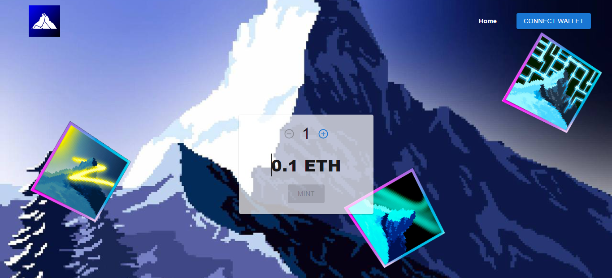

# The smart contract of Mountains Club's NFT Mint

## Live site

## Contact info
- **Email:** mr.new0509@gmail.com
- **Telegram:** [@mrnew0509](https://t.me/mrnew0509)
- **Skype:** [@sin085](https://join.skype.com/invite/xat3AgpiRVOI)

## Release date
Nov 16, 2022

## Last updated at
Nov 26, 2022

## Environment
- `Node.js v18.12.0`

## Stack
- **Framework:** `Hardhat v2.12.2`, `Openzepplin v4.4.0`

## How to run the project.
1. Please open terminal window in the root directory.
2. Please run commands in the following cases.
- To deploy
`npx hardhat run scripts/run.js --network goerli`

- To verify the smart contract
`npx hardhat verify [contract address]`

